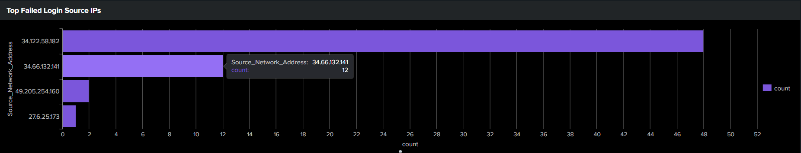
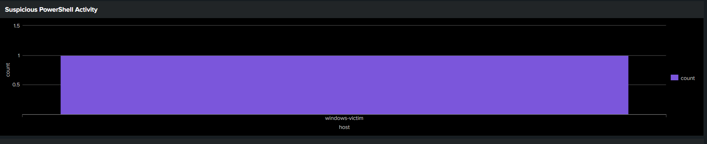
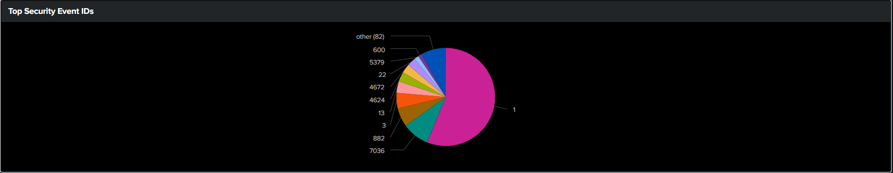
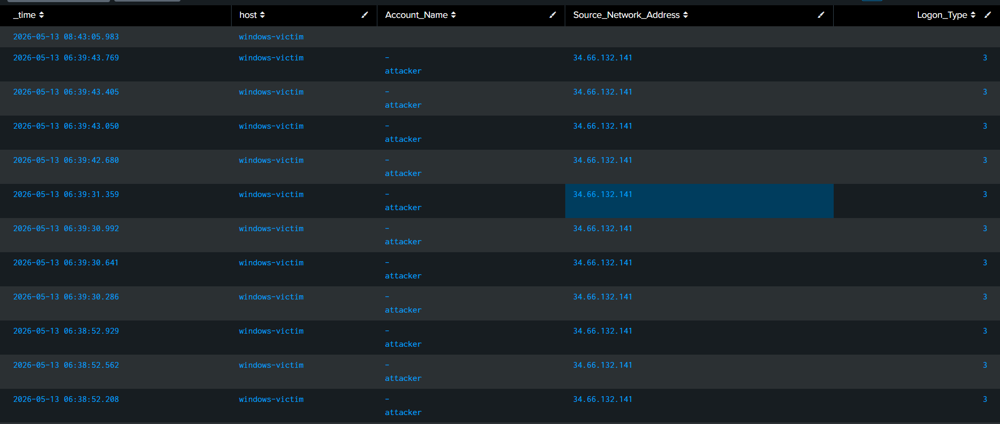
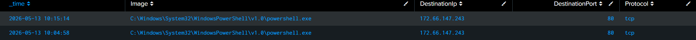
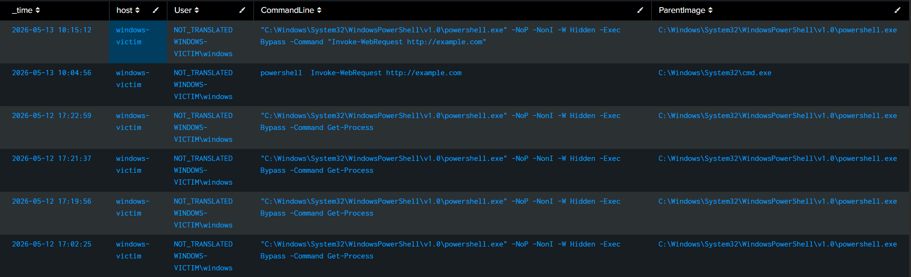
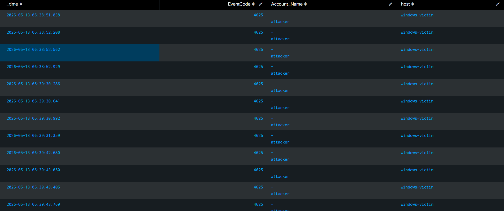

# SOC-Detection-Engineering-Threat-Hunting-Lab-using-Splunk-Sysmon-and-GCP

# SOC Detection Lab using Splunk, Sysmon & GCP

## Overview

Built a cloud-based SOC (Security Operations Center) lab using Splunk Enterprise, Sysmon, Windows event logging, and Google Cloud Platform (GCP) to simulate and detect real-world attack scenarios.

## Architecture

* Ubuntu Server running Splunk Enterprise (SIEM)
* Windows Server endpoint with Sysmon installed
* Debian attacker VM for attack simulation
* Splunk Universal Forwarder for centralized log collection
```text
[Kali / Debian Attacker]
│
├── brute force attacks
├── PowerShell abuse
├── reconnaissance scans
├── payload delivery
▼

[Windows Victim]
│
├── Sysmon telemetry
├── Windows Event Logs
├── Security Logs
├── PowerShell Logs
▼

[Splunk Universal Forwarder]
│
├── forwards telemetry
▼

[Ubuntu Splunk SIEM]
│
├── dashboards
├── alerts
├── detections
├── correlation rules
└── incident investigations
```
  ## Project Workflow

1. Created three cloud-based virtual machines on Google Cloud Platform (GCP) to simulate a SOC environment:

   * Attacker Machine (Debian Linux)
   * Victim Machine (Windows Server)
   * Monitoring Server (Ubuntu Splunk SIEM)

2. Configured a centralized telemetry pipeline between the Windows victim machine and the Splunk monitoring server using Splunk Universal Forwarder.

3. Installed and configured Sysmon on the Windows endpoint to generate detailed security telemetry such as process creation, PowerShell activity, authentication events, and network connections.

4. Simulated multiple attack scenarios from the attacker machine including brute-force attacks, PowerShell abuse, LOLBins, persistence techniques, and malware-like behavior.

5. Forwarded security logs and telemetry from the victim machine to Splunk SIEM for monitoring and analysis.

6. Created dashboards, alerts, correlation rules, and detection queries using SPL (Search Processing Language) to identify suspicious behavior and attack patterns.

7. Performed threat hunting, incident investigation, IOC extraction, and MITRE ATT&CK mapping using the collected telemetry.

   
## Attack Simulations
### Brute Force Attack
- Simulated RDP brute-force attacks from the Debian attacker VM using Hydra.
- Generated Windows authentication failure logs (EventCode 4625).
- Created Splunk alerts and detections for repeated failed login attempts.

### Encoded PowerShell Execution
- Simulated suspicious PowerShell execution using encoded and hidden PowerShell commands.
- Monitored process creation events using Sysmon Event ID 1.
- Created detections for PowerShell abuse and suspicious execution flags.

### LOLBin Abuse (certutil)
- Simulated Living-Off-The-Land Binary (LOLBin) abuse using certutil.exe.
- Monitored suspicious command-line activity and process telemetry.
- Built detections for trusted binary abuse behavior.

### Persistence Simulation
- Simulated persistence using scheduled task creation with schtasks.exe.
- Monitored persistence-related process activity through Sysmon logs.
- Created detections for suspicious scheduled task creation.

### Network Activity Monitoring
- Simulated network connections and outbound communication using PowerShell and system utilities.
- Monitored Sysmon Event ID 3 network telemetry.
- Investigated unusual ports and suspicious outbound connections.

## Detection Examples
### Brute Force Detection
```spl
index=* EventCode=4625
| stats count by Source_Network_Address
| where count > 5
```
## Suspicious PowerShell Detection
```spl
index=* EventCode=1 Image="*powershell.exe"
(CommandLine="*-nop*" OR CommandLine="*-exec bypass*" OR CommandLine="*-w hidden*")
```
## LOLBin Detection
```spl
index=* EventCode=1 Image="*certutil.exe"
| table _time host User CommandLine
```
## Network Connection Monitoring
```spl
index=* EventCode=3
| stats count by DestinationPort
| sort - count
```
## Dashboards










## Features Implemented

* Centralized log collection using Splunk
* Sysmon endpoint telemetry monitoring
* Brute-force attack simulation and detection
* PowerShell abuse detection
* LOLBin detection (certutil)
* Scheduled task persistence detection
* Network connection monitoring using Sysmon Event ID 3
* SIEM dashboards and alerts
* MITRE ATT&CK technique mapping
* Correlation rules for multi-stage attack detection

## Technologies Used

* Splunk Enterprise
* Sysmon
* Windows Event Logs
* Google Cloud Platform (GCP)
* Debian Linux
* PowerShell
* SPL (Search Processing Language)


### Brute Force Detection

```spl
index=* EventCode=4625
| stats count by Source_Network_Address
| where count > 5
```

### Suspicious PowerShell Detection

```spl
index=* EventCode=1 Image="*powershell.exe"
(CommandLine="*-nop*" OR CommandLine="*-exec bypass*" OR CommandLine="*-w hidden*")
```

## Skills Gained

* SIEM monitoring
* Threat detection
* Log analysis
* Incident investigation
* SOC workflows
* Detection engineering
* Windows telemetry analysis
* MITRE ATT&CK mapping

## What I actually did in this project
1. I used 3 machines :
   Attacker - linux
   Victim - windows
   Monitoring - linux
2. Build a telemetry pipeline between the victim and the monitor 
3. Attacked victim from attacker by using several tools and techniques
4. The forwarder in the victim sends the logs to the monitor through pipeline
5. The monitor then used to analyze the logs and create dashvboards to understand the logs easily and created alerts for better incident response
