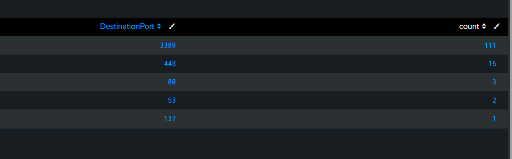

# SOC-Detection-Engineering-Threat-Hunting-Lab-using-Splunk-and-Sysmon

# SOC Detection Lab using Splunk, Sysmon & GCP

## Overview

Built a cloud-based SOC (Security Operations Center) lab using Splunk Enterprise, Sysmon, Windows event logging, and Google Cloud Platform (GCP) to simulate and detect real-world attack scenarios.

## Architecture

* Ubuntu Server running Splunk Enterprise (SIEM)
* Windows Server endpoint with Sysmon installed
* Debian attacker VM for attack simulation
* Splunk Universal Forwarder for centralized log collection

  [Kali]
  │
  ├── brute force
  ├── PowerShell abuse
  ├── scans
  ├── payload delivery
  ▼

[Windows Victim]
  │
  ├── Sysmon
  ├── Windows Event Logs
  ├── Security Logs
  ▼

[Splunk Server]
  │
  ├── detections
  ├── dashboards
  ├── alerts
  └── investigations

  ## Project Workflow

1. Created three cloud-based virtual machines on Google Cloud Platform (GCP) to simulate a SOC environment:

   * Attacker Machine (Debian Linux)
   * Victim Machine (Windows Server)
   * Monitoring Server (Ubuntu Splunk SIEM)

2. Configured a centralized telemetry pipeline between the Windows victim machine and the Splunk monitoring server using Splunk Universal Forwarder.

3. Installed and configured Sysmon on the Windows endpoint to generate detailed security telemetry such as process creation, PowerShell activity, authentication events, and network connections.

4. Simulated multiple attack scenarios from the attacker machine including brute-force attacks, PowerShell abuse, LOLBins, persistence techniques, and malware-like behavior.

5. Forwarded security logs and telemetry from the victim machine to Splunk SIEM for monitoring and analysis.

6. Created dashboards, alerts, correlation rules, and detection queries using SPL (Search Processing Language) to identify suspicious behavior and attack patterns.

7. Performed threat hunting, incident investigation, IOC extraction, and MITRE ATT&CK mapping using the collected telemetry.
## Attack Simulations

## Detection Examples

## Dashboards





## Features Implemented

* Centralized log collection using Splunk
* Sysmon endpoint telemetry monitoring
* Brute-force attack simulation and detection
* PowerShell abuse detection
* LOLBin detection (certutil)
* Scheduled task persistence detection
* Network connection monitoring using Sysmon Event ID 3
* SIEM dashboards and alerts
* MITRE ATT&CK technique mapping
* Correlation rules for multi-stage attack detection

## Technologies Used

* Splunk Enterprise
* Sysmon
* Windows Event Logs
* Google Cloud Platform (GCP)
* Debian Linux
* PowerShell
* SPL (Search Processing Language)


### Brute Force Detection

```spl
index=* EventCode=4625
| stats count by Source_Network_Address
| where count > 5
```

### Suspicious PowerShell Detection

```spl
index=* EventCode=1 Image="*powershell.exe"
(CommandLine="*-nop*" OR CommandLine="*-exec bypass*" OR CommandLine="*-w hidden*")
```

## Skills Gained

* SIEM monitoring
* Threat detection
* Log analysis
* Incident investigation
* SOC workflows
* Detection engineering
* Windows telemetry analysis
* MITRE ATT&CK mapping

